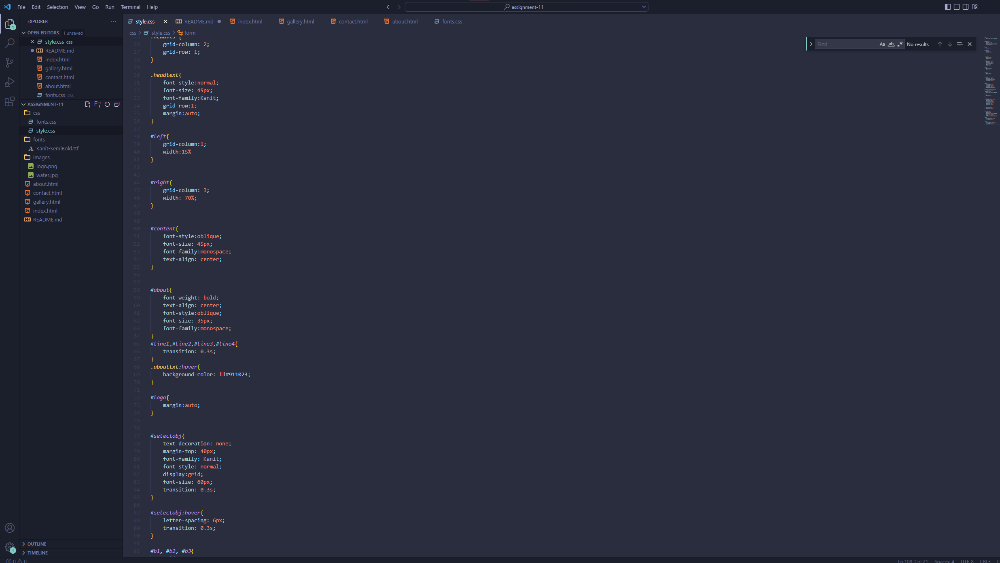

1) Typface is the design of text. Its generally used interchangably with font but font is actually the file, while typeface 
is the design itself. 
 
2) A fallback font allows a broweser to use a lower resource font in case one is loading slowly. Its good to plan this out  
for the user's sake.  
3) System Fonts come pre-downloaded with an operating system, usually considered the web-safe fonts that most people can render quickly. 
Web fonts however are fonts that are usually downloaded with a browser, therefor not all people may have them.
 
 

