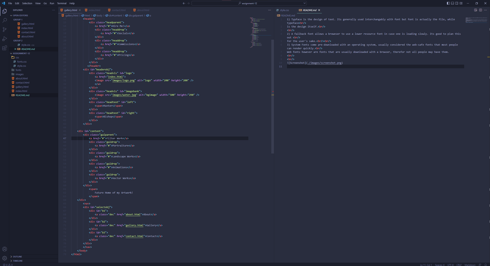

1) Padding adjusts the interior width separating an item nested within its element from the edge of the element,  
while margin adjusts the distance between elements. A border is can be placed on the edge of an element making it  
clearly defined.
  
2) This week's assignment was awesome! im loving how my site is shaping up these past few weeks!

  

