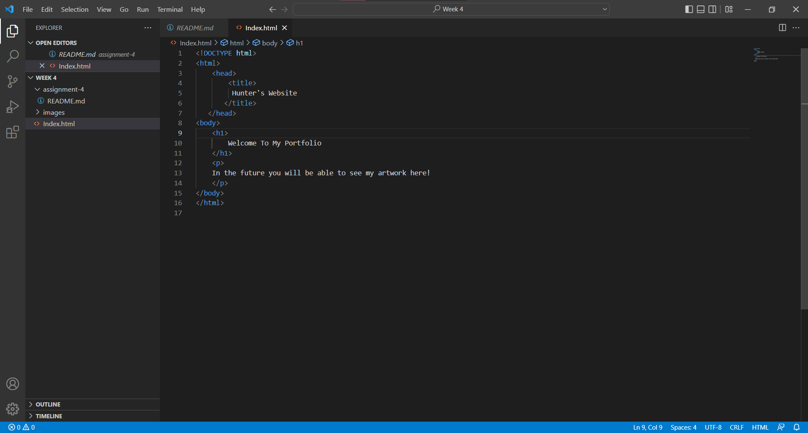

#1) Browsers have the complicated task of managing network requests/sends as well as using a rendering engine
    to interpret and display the code it recieves. On top of this a browser provides the interactive functionality
    required to use a webpage, as well as storing data such as cookies. 
    Personally I have always just used chrome, there was a time when I was more interested in web development and I did
    dabble in firefox at that time as well.
    
#2) Screenshot of Index page work
