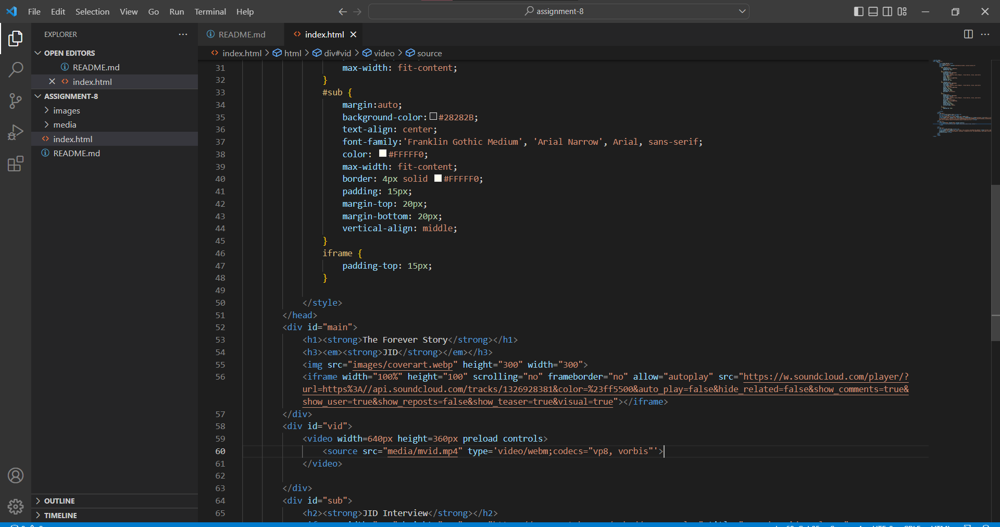

NOTE: MY VIDEO FILE WAS TOO LARGE TO UPLOAD TO GITHUB BUT THE LINK DOES WORK LOCALLY FOR ME!!!  
An affordance is the visual assumption of somethings purpose as well as its actual purpose. In the context of design  
a power button symbol affords that it will turn something on or off, as it has been used this way for many years. 
 
In terms of ease of use in a casual sense nothing can beat YouTube, but for more robust applications and avoiding  
copyright trouble other services and formats, like webm's for exampls, might be a better option.
  
This week I wanted to do a bit more CSS and ended up getting a little bit confused. I stuck with it though and managed to  
learn some things!

