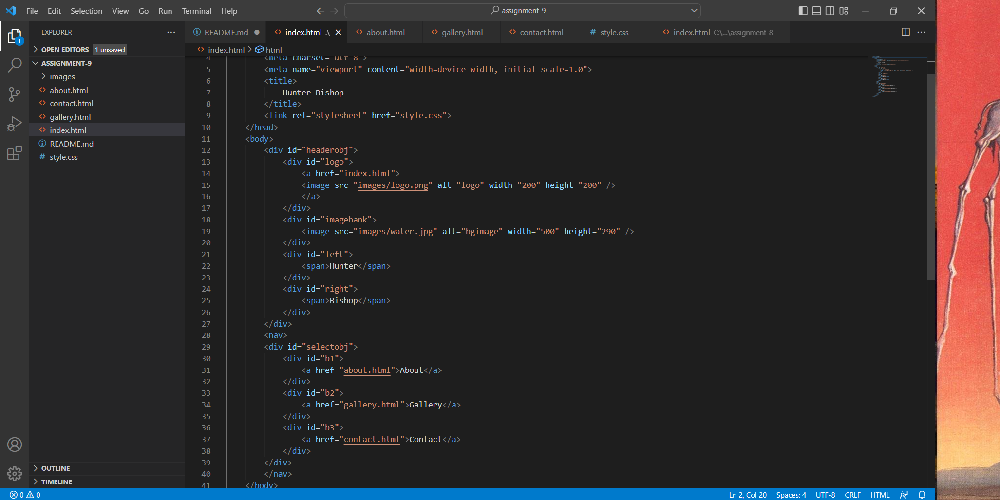

1) As an art student I dont get to do coding that often, but this class really  
re-ignited my interest in html/css coming back to html after so many years was really fun.  
2) I started doing a bit more Css this week than weeks past and am very excited to continue! Hopinng  
I can start focusing in on this website that I made this week.
